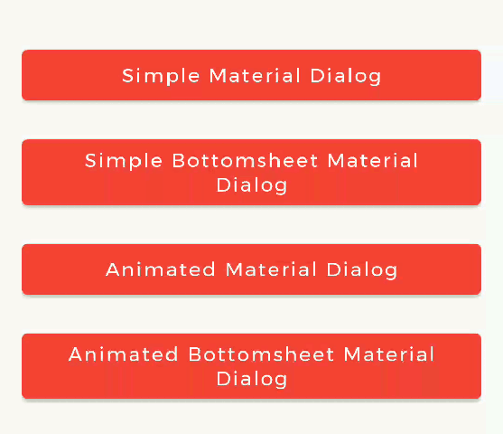
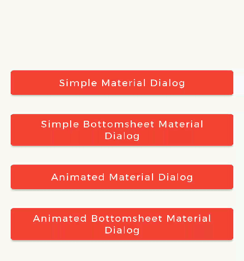
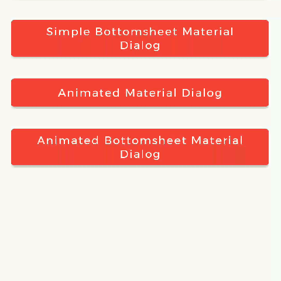
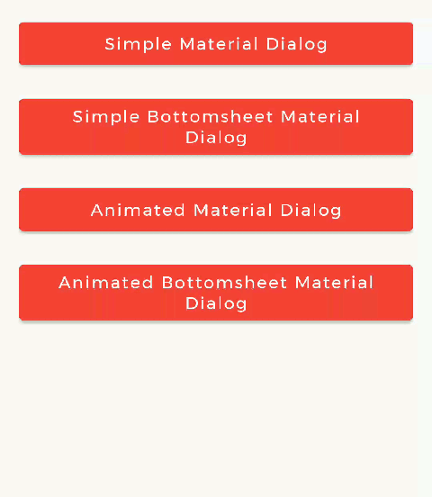
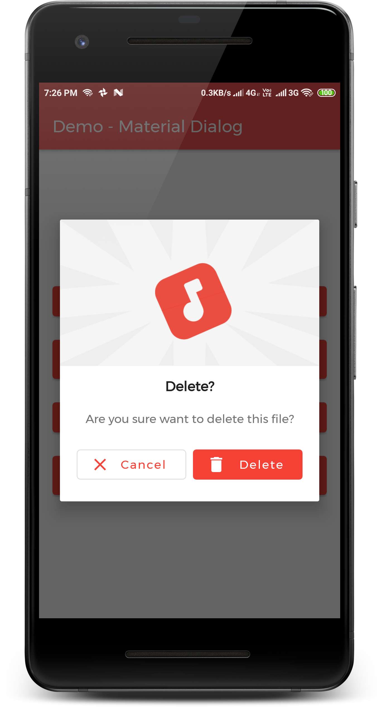
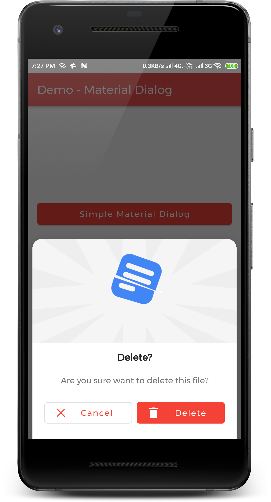
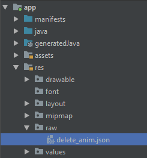
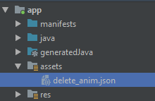

[](http://androidweekly.net/issues/issue-392)


# Material Dialogs for Android 📱

📱Android Library to implement *animated*, 😍*beautiful*, 🎨*stylish* Material Dialog in android apps easily.

<table style="width:100%">
  <tr>
    <th><b>1. Material Dialog<b></b></th>
    <th>2. Animated Material Dialog</th> 
    <th>3. Bottom Sheet Material Dialog</th>
    <th>4. Animated Bottom Sheet Material Dialog</th>
  </tr>
  <tr>
    <td></td>
    <td></td> 
    <td></td>
    <td></td>
  </tr>
</table>


# Table of Contents:
> - [ Introduction ](#introduction)
> - [ Types of Dialog ](#types)
> - [ Implementation ](#implementation)
>    - [ Prerequisite ](#prerequisite)
>    - [ Create Dialog Instance ](#createDialogInstance)
>        - [ Material Dialog ](#createMaterialDialog)
>        - [ Bottom Sheet Material Dialog ](#createBsMaterialDialog)
>    - [ Text Alignment ](#textAlignment)
>    - [ HTML formatting for Message ](#htmlFormatting)
>    - [ Show Animations ](#showAnims)
>        - [ Using `Resource` File ](#showAnimRes)
>        - [ Using `Asset` File ](#showAnimFile)
>        - [ Getting `LottieAnimationView` ](#getLottieAnimationView)
>    - [ Dialog State Listeners ](#stateCallbacks)
> - [ Contribute ](#contribute)    
> - [ Credits ](#credits)    

<a name="introduction"></a>
## Introduction
**MaterialDialog** library is built upon Google's Material Design library. This API will be useful to create rich, animated, beautiful dialogs in Android app easily. 
This library implements Airbnb's [*Lottie*](https://github.com/airbnb/lottie-android) library to render After Effects animation in app.
Refer [this](https://airbnb.io/lottie/#/) for Lottie documentation.

<a name="types"></a>
## Types of Dialog
**MaterialDialog** library provides two types of dialog i.e. 

<table style="width:100%">
  <tr>
    <th><b>1. Material Dialog<b></b></th>
    <th>2. Bottom Sheet Material Dialog</th>
  </tr>
  <tr>
    <td>This is basic material dialog which has two material buttons (Same as Android's AlertDialog) as you can see below.</td>
    <td>This is Bottom Sheet material dialog which has two material buttons which is showed from bottom of device as you can see below.</td> 
  </tr>
  <tr>
    <td align="center"></td>
    <td align="center"></td> 
  </tr>
</table>

<a name="implementation"></a>
## Implementation
Implementation of Material Dialog library is so easy. You can check [/app](/app) directory for demo. Let's have look on basic steps of implementation.
<a name="prerequisite"></a>
### Prerequisite
#### i. Gradle
In `Build.gradle` of app module, include these dependencies. If you want to show animations, include *Lottie* animation library.

This library is available on [MavenCentreal](https://search.maven.org/artifact/dev.shreyaspatil.MaterialDialog/MaterialDialog/)

```groovy

repositories {
    mavenCentral()
}

dependencies {

    // Material Dialog Library
    implementation 'dev.shreyaspatil.MaterialDialog:MaterialDialog:2.2.3'

    // Material Design Library
    implementation 'com.google.android.material:material:1.0.0'

    // Lottie Animation Library
    implementation 'com.airbnb.android:lottie:3.3.6'
}
```
#### ii. Set up Material Theme
Setting Material Theme to app is necessary before implementing Material Dialog library. To set it up, update [`styles.xml`](app\src\main\res\values\styles.xml) of `values` directory in app.
```xml
<resources>
    <style name="AppTheme" parent="Theme.MaterialComponents.Light">
        <!-- Customize your theme here. -->
        ...
    </style>
</resources>
```
These are required prerequisites to implement Material Dialog library.

#### iii. Customize Dialog Theme (Optional)
If you want to customize dialog view, you can override style in `styles.xml` as below.
```xml
    <!-- Base application theme. -->
    <style name="AppTheme" parent="Theme.MaterialComponents.Light.DarkActionBar">
        <item name="colorPrimary">@color/colorPrimary</item>
        <item name="colorPrimaryDark">@color/colorPrimaryDark</item>
        <item name="colorAccent">@color/colorAccent</item>
        <item name="android:fontFamily">@font/montserrat</item>

        <!-- Customize your theme here. -->
        <item name="material_dialog_background">#FFFFFF</item>
        <item name="material_dialog_title_text_color">#000000</item>
        <item name="material_dialog_message_text_color">#5F5F5F</item>
        <item name="material_dialog_positive_button_color">@color/colorAccent</item>
        <item name="material_dialog_positive_button_text_color">#FFFFFF</item>
        <item name="material_dialog_negative_button_text_color">@color/colorAccent</item>
    </style>
```

<a name="createDialogInstance"></a>
### Create Dialog Instance
As there are two types of dialogs in library. Material Dialogs are instantiated as follows.
<a name="createMaterialDialog"></a>
#### i. Material Dialog
`MaterialDialog` class is used to create Material Dialog. Its static `Builder` class is used to instantiate it. After building, to show the dialog, `show()` method of `MaterialDialog` is used.
```java
        MaterialDialog mDialog = new MaterialDialog.Builder(this)
                .setTitle("Delete?")
                .setMessage("Are you sure want to delete this file?")
                .setCancelable(false)
                .setPositiveButton("Delete", R.drawable.ic_delete, new MaterialDialog.OnClickListener() {
                    @Override
                    public void onClick(DialogInterface dialogInterface, int which) {
                        // Delete Operation
                    }
                })
                .setNegativeButton("Cancel", R.drawable.ic_close, new MaterialDialog.OnClickListener() {
                    @Override
                    public void onClick(DialogInterface dialogInterface, int which) {
                        dialogInterface.dismiss();
                    }
                })
                .build();

        // Show Dialog
        mDialog.show();
```


<a name="createBsMaterialDialog"></a>
#### ii. Bottom Sheet Material Dialog
`BottomSheetMaterialDialog` class is used to create Bottom Sheet Material Dialog. Its static `Builder` class is used to instantiate it. After building, to show the dialog, `show()` method of `BottomSheetMaterialDialog` is used.
```java
        BottomSheetMaterialDialog mBottomSheetDialog = new BottomSheetMaterialDialog.Builder(this)
                .setTitle("Delete?")
                .setMessage("Are you sure want to delete this file?")
                .setCancelable(false)
                .setPositiveButton("Delete", R.drawable.ic_delete, new BottomSheetMaterialDialog.OnClickListener() {
                    @Override
                    public void onClick(DialogInterface dialogInterface, int which) {
                        Toast.makeText(getApplicationContext(), "Deleted!", Toast.LENGTH_SHORT).show();
                        dialogInterface.dismiss();
                    }
                })
                .setNegativeButton("Cancel", R.drawable.ic_close, new BottomSheetMaterialDialog.OnClickListener() {
                    @Override
                    public void onClick(DialogInterface dialogInterface, int which) {
                        Toast.makeText(getApplicationContext(), "Cancelled!", Toast.LENGTH_SHORT).show();
                        dialogInterface.dismiss();
                    }
                })
                .build();

        // Show Dialog
        mBottomSheetDialog.show();
```


<a name="textAlignment"></a>
### Text Alignment

Text alignment  is supported for _title_ and _message_ of a dialog. It's configurable while building a dialog.
If it's not provided in builder, `TextAlignment.CENTER` is considered by default i.e. it'll be always aligned in a ***center***.

**Following Alignment Enum Values are allowed to be used for Dialog text alignment:**

- `TextAlignment.START`: Aligns text at start / left.
- `TextAlignment.CENTER`: Aligns text at center.
- `TextAlignment.END`: Aligns text at end / right.

**Example usage:**

```java
        MaterialDialog mDialog = new MaterialDialog.Builder(this)
                .setTitle("Lorem Ipsum Title", TextAlignment.START)
                .setMessage("Lorem Ipsum Message", TextAlignment.START)
```


<a name="htmlFormatting"></a>

### HTML formatting for Message

HTML spanned text is supported only for dialog's ***message***. While setting a message, you can directly provide `Spanned` instance as shown in following example.

```java
        MaterialDialog mDialog = new MaterialDialog.Builder(this)
                .setMessage(Html.fromText("<b>Lorem <i>Ipsum</i></b>. <br> Click <a href=\"https://example.com\">here</a> for more information"))
```

<a name="showAnims"></a>
### Show Animations
<table style="width:100%">
  <tr>
    <th>Material Dialog</th> 
    <th>Bottom Sheet Material Dialog</th>
  </tr>
  <tr>
    <td></td>
    <td></td>
  </tr>
</table>

Animations in this library are implemented using Lottie animation library. You can get free animations files [here](https://lottiefiles.com/). You can find varieties of animation files on [https://lottiefiles.com](https://lottiefiles.com/).
`*.json` file downloaded from *LottieFiles* should be placed in android project. There are two ways to place animation file (`*.json`).

For example, here `delete_anim.json` animation file is used to show file delete animation.
<a name="showAnimRes"></a>
#### i. Using `Resource` File
Downloaded json file should placed in `raw` directory of `res`.



In code, `setAnimation()` method of `Builder` is used to set Animation to the dialog.

Prototype :
> setAnimation(int resourceId)

Resource file should be passed to method. e.g. `R.raw.delete_anim`. 
```java
        MaterialButton mDialog = new MaterialDialog.Builder(this)
                .setAnimation(R.raw.delete_anim)
```
<a name="showAnimFile"></a>
#### ii. Using `Asset` File
Downloaded json file should placed in `asset` directory.



In code, `setAnimation()` method of `Builder` is used to set Animation to the dialog.

Prototype:
> setAnimation(String fileName)

**Only** file name ***with extensions*** should passed to method.
```java
        MaterialButton mDialog = new MaterialDialog.Builder(this)
                // Other Methods to create Dialog........               
                .setAnimation("delete_anim.json")               
                //...
```

<a name="getLottieAnimationView"></a>
#### iii. Getting `LottieAnimationView` 
To get `View` of Animation for any operations, there is a method in Material Dialogs which returns `LottieAnimationView` of dialog.
```java
        // Get Animation View
        LottieAnimationView animationView = mDialog.getAnimationView();
        // Do operations on animationView
```

<a name="stateCallbacks"></a>
### Dialog State Listeners 
There are three callback events and listeners for Dialog.

Following are interfaces for implementations:
- `OnShowListener()` - Listens for dialog Show event. Its `onShow()` is invoked when dialog is displayed.
- `OnCancelListener()` - Listens for dialog Cancel event. Its `onCancel()` is invoked when dialog is cancelled.
- `OnDismissListener()` - Listens for dialog Dismiss event. Its `onDismiss()` is dismiss when dialog is dismissed.
```java
       ... 
       mDialog.setOnShowListener(this);
       mDialog.setOnCancelListener(this);
       mDialog.setOnDismissListener(this);
    }
    
    @Override
    public void onShow(DialogInterface dialogInterface) {
        // Dialog is Displayed
    }

    @Override
    public void onCancel(DialogInterface dialogInterface) {
        // Dialog is Cancelled
    }

    @Override
    public void onDismiss(DialogInterface dialogInterface) {
        // Dialog is Dismissed
    }
}
```

<a name="contribute"></a>
## Contribute
Let's develop with collaborations. We would love to have contributions by raising issues and opening PRs. Filing an issue before PR is must.
See [Contributing Guidelines](CONTRIBUTING.md). 

<a name="credits"></a>
## Credits
This library is built using following open-source libraries.
- [Material Components for Android](https://github.com/material-components/material-components-android)
- [Lottie for Android](https://github.com/airbnb/lottie-android)

## License
Project is published under the Apache 2.0 license. Feel free to clone and modify repo as you want, but don't forget to add reference to authors :)

